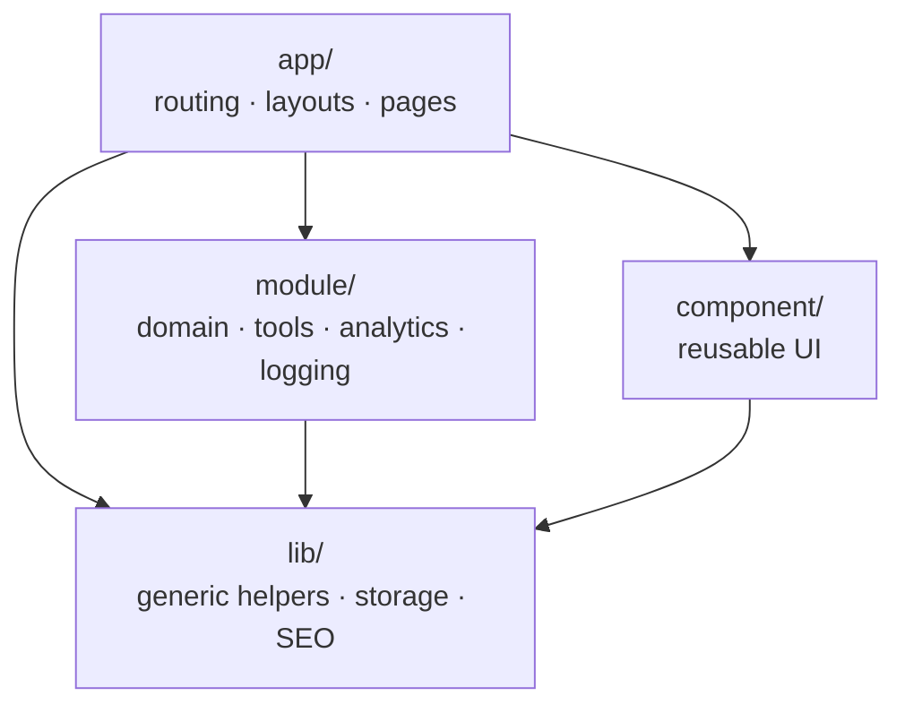
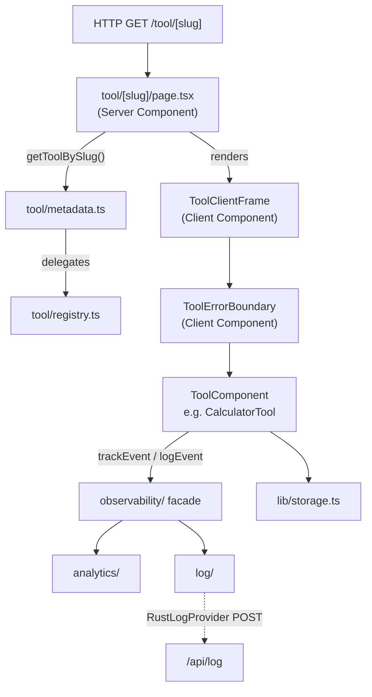

# ARCHITECTURE

This document defines the architectural boundaries of the project.
Any generated code MUST follow this structure.

## Core Goal

Build a scalable, full-stack utility platform using Next.js App Router,
with strict separation between:
- routing/composition
- business logic
- UI primitives
- tool implementations

The architecture must remain boring, explicit, and predictable.

---

## High-level Structure

```
src/
  app/          -> routing, layouts, pages (composition only)
  module/       -> domain logic, tools, registries, analytics, logging, observability
  component/    -> reusable UI (no domain logic)
  lib/          -> shared utilities (non-UI)
```

---

## Architecture Diagrams

### Layer dependencies

Arrows show allowed import direction. `lib/` has no project-level imports.



### Tool page rendering pipeline

From HTTP request to rendered tool, showing the server/client split and
observability path.



---

## Responsibilities by layer

### app/
- Defines routes and layouts
- Selects which components/modules to render
- Does NOT implement business logic
- Does NOT contain tool logic
- Server Components by default

**Routes:**
- `/` — Home page (`page.tsx`, `HomeClient.tsx`)
- `/discover` — Tool discovery page with category grouping and search
  (`discover/page.tsx`, `discover/DiscoverClient.tsx`)
- `/tool/[slug]` — Individual tool page (`tool/[slug]/page.tsx`)
- `/category/[category]` — Category listing page (`category/[category]/page.tsx`)
- `/api/health` — Health check endpoint (`api/health/route.ts`)
- `/api/log` — Client log ingestion endpoint (`api/log/route.ts`)

**Supporting files:**
- `navData.ts` — Navigation item definitions
- `global.css` — CSS custom properties for theming

### module/
- Owns all domain concepts (tools, registry, capabilities, analytics, logging,
  observability)
- Tool implementations live here
- Analytics abstraction lives here
- Logging module lives here
- Observability facade lives here
- UI allowed ONLY inside tool components
- No routing logic allowed

### component/
- Pure UI components
- No knowledge of tools, slugs, or routing
- No side effects unless explicitly client-only

**Subgroups:**
- `common/` — Generic reusable components (Button, Input, StatusPanel,
  ToolSearch, ThemeToggle)
- `layout/` — App shell, header, footer, navigation, ad banner placeholders,
  layout types, ServiceWorkerRegister
- `tool/` — Tool-specific presentation components (ToolPageTemplate,
  ToolClientFrame, ToolSection, ToolErrorBoundary)

### lib/
- Generic helpers (SEO helpers, formatting utilities, storage abstraction)
- No React components
- No imports from module/ layer

---

## Server vs Client rule

- Pages (`app/**/page.tsx`) are Server Components
- Tool UI components are Client Components
- Do NOT mark layouts or pages as `"use client"`

---

## Tool system

Tools are the core domain concept. Each tool is a React component registered
in `src/module/tool/registry.ts` via the `tool_definition_list` array.

### Registry (`src/module/tool/registry.ts`)
- Single source of truth for all tool definitions
- Provides low-level queries: `getToolBySlug()`, `getToolByCategory()`
- All tools are explicitly imported and registered

### Metadata index (`src/module/tool/metadata.ts`)
- Higher-level query layer wrapping the registry
- Provides: `getAllTool()`, `getToolSeoBySlug()`, `getAllToolSeo()`,
  `getAvailableCategory()`, `getToolCount()`, `getAllTag()`, `getToolByTag()`,
  `getToolByPopularity()`
- Does NOT duplicate registry data — delegates to `tool_definition_list`
- New query functions go here, not in registry
- `getToolBySlug()` / `getToolByCategory()` remain registry-level exports (see
  above) and are not re-exported from `metadata.ts`

### Current tools
- **Slugify Text** (`text/SlugifyTool.tsx`) — Convert text into URL-safe slugs
- **HTML Text Extractor** (`text/HtmlTextExtractorTool.tsx`) — Extract visible
  text from HTML with preserved line breaks
- **Calculator** (`math/CalculatorTool.tsx`) — Evaluate simple math expressions
- **Length Converter** (`everyday/LengthConverterTool.tsx`) — Convert between
  common length units
- **Weight Converter** (`everyday/WeightConverterTool.tsx`) — Convert between
  common weight units
- **Time Arithmetic** (`time/TimeArithmeticTool.tsx`) — Add and subtract
  HH:MM time values with carry/borrow normalization (`time/timeArithmetic.ts`
  holds the pure `calculateTime`/`addTime`/`subtractTime` logic)

### Recently used tool tracking (`src/module/tool/recentlyUsed.ts`)
- `getRecentTool()` — Returns list of recently used tool slugs
- `recordRecentTool(slug)` — Adds a slug to front of list, deduplicates, caps at
  10
- `clearRecentTool()` — Clears the list
- Uses `storage` abstraction, SSR-safe
- Does not modify tool components — consumer must call `recordRecentTool`
  explicitly

---

## Analytics abstraction (`src/module/analytics/`)

Platform-level analytics with swappable provider.

### Structure
- `type.ts` — event names, event prop interfaces, provider interface
- `provider.ts` — local lightweight provider (console + localStorage counter)
- `index.ts` — public API: `track()`, `identify()`, `enableAnalytic()`,
  `disableAnalytic()`, `setAnalyticProvider()`

### Rules
- Tools call only `trackEvent()` from `@/module/observability`
- No direct SDK usage inside tool components
- Provider can be swapped at startup via `setAnalyticProvider()`
- Events: `tool_opened`, `tool_executed`, `tool_result_copied`,
  `tool_mode_changed`

---

## Logging module (`src/module/log/`)

Internal system visibility with swappable providers.

### Structure
- `types.ts` — `LogLevel` (`debug`, `info`, `warn`, `error`), `LogMeta`
- `provider.ts` — `LogProvider` interface
- `logger.ts` — `ConsoleProvider` (default), `log` object (`log.debug`,
  `log.info`, `log.warn`, `log.error`), `setLogProvider()`, `setLogLevel()`
- `RustLogProvider.ts` — Provider that sends logs to `/api/log` via fetch
  (non-blocking, fail-silent)

### Rules
- Level filtering via `setLogLevel()`
- Providers are swappable via `setLogProvider()`
- All logging is non-blocking and SSR-safe
- `ConsoleProvider` never throws

---

## Observability Layer (`src/module/observability/`)

Combined facade unifying analytics and logging.

### API
- `trackEvent(event, prop)` — Product metrics (delegates to analytics `track()`)
- `logEvent(message, meta?)` — System debugging (delegates to `log.info()`)
- `captureError(error, meta?, trackAsEvent?)` — Logs error and optionally tracks
  an analytics event

### Principles
1. **Separation of Concerns**: Logging (technical) and Analytics (product)
   remain separate layers but are unified in the observability facade.
2. **Layering**:
   - `trackEvent()`: Product metrics.
   - `logEvent()`: System debugging.
   - `captureError()`: Automatic logging + optional analytics emission.
3. **Provider-Swappable**: Both logging and analytics support swappable
   providers.
4. **Non-Blocking**: Observability operations must never throw or block the UI
   thread.

---

## Error Handling Policy

### Tool Error Boundary (`src/component/tool/ToolErrorBoundary.tsx`)
- All tools are wrapped in a global error boundary inside `ToolClientFrame`.
- Catches runtime errors in tool components.
- Calls `captureError()` automatically with toolId and component stack.
- Displays a user-friendly fallback UI with a "Try again" option.

### Rules
- No direct `console.log` usage; use `log.info/warn/error` or `logEvent`.
- No direct analytics SDK calls; use `trackEvent`.
- Always use `captureError` in catch blocks at architectural boundaries.

---

## Log ingestion endpoint (`src/app/api/log/route.ts`)

Server-side endpoint for client log events sent by `RustLogProvider`.

### Behavior
- Accepts POST with JSON body: `{ level, message, timestamp, meta?, url? }`
- Validates body shape and log level (`debug`, `info`, `warn`, `error`)
- Writes to server `console.log` as a safe sink
- Returns 204 on success, 400 on invalid input
- Fails safely — never exposes secrets or blocks

---

## Theme module (`src/module/theme/`)

The theme system is a multi-theme registry, not a binary light/dark switch.
`ThemeId` (`themeRegistry.ts`) declares eight selectable themes: `system`,
`light`, `dark`, `onedark`, `vscode-modern`, `dracula`, `amethyst-haze`, and
`mercury-fog`. `doc/DESIGN.md` is the canonical visual authority and documents all eight
canonical themes alongside the current theme registry and runtime ownership.

### Structure
- `themeRegistry.ts` — declares `ThemeId`, the `theme_definition_list`
  (id/label/description per theme), `listThemes()`, and the `isThemeId()` type
  guard
- `themeStorage.ts` — `storeTheme(themeId)` / `loadTheme()`, persists the
  chosen `ThemeId` under the `"theme"` storage key via the `storage` adapter
- `themeRuntime.client.ts` — `setTheme(themeId)` / `getThemeFromDom()`, applies
  the theme by setting (or removing, for `"system"`) the `data-theme`
  attribute on `document.documentElement`; browser-context only

### Components
- `ThemeToggle` (`src/component/common/ThemeToggle.tsx`) — Client component in
  Header; lets the user pick from the registered theme list
- `ThemeProvider` (`src/component/common/ThemeProvider.tsx`) — Client
  component that applies the persisted/system theme on mount
- Inline script in `layout.tsx` reads `localStorage("theme")` before paint to
  prevent FOUC
- `suppressHydrationWarning` on `<html>` prevents hydration mismatch

### Behavior
- Reads user preference from `storage` via `themeStorage.loadTheme()`
- Falls back to system preference (`"system"` → no `data-theme` attribute;
  CSS `prefers-color-scheme` rule applies) via `matchMedia`
- Persists choice via `themeStorage.storeTheme(themeId)`
- Sets `data-theme` attribute on `<html>` via `themeRuntime.client.ts` to
  switch CSS variable tokens in `src/style/theme.css`

---

## Navigation wiring

- `NavItem` type in `src/component/layout/type.ts` includes optional `href`
- `navData.ts` defines items with real route hrefs: Home (`/`), Discover
  (`/discover`)
- `VerticalNav` is a Client Component that renders `Link` from `next/link` for
  items with `href`
- Active state determined by `usePathname()` match against `href`
- Items without `href` or with `disabled` render as non-interactive spans

---

## Service worker (`public/sw.js`)

Minimal offline caching for PWA support.

### Strategy
- **Install**: Precaches `/` and `/discover`
- **Navigation requests**: Network first, cache fallback (stale-while-offline)
- **Static assets**: Cache first, network fallback
- **API routes**: Network only (no caching)
- **Activation**: Cleans old caches, claims all clients

### Registration
- `ServiceWorkerRegister` (`src/component/layout/ServiceWorkerRegister.tsx`) —
  Client component
- Registers `/sw.js` on mount, fails silently
- Included in root `layout.tsx`

---

## Persistent state layer (`src/lib/storage.ts`)

Unified persistence abstraction.

### API
- `storage.get<T>(key)` — read and parse JSON
- `storage.set<T>(key, value)` — serialize and write
- `storage.remove(key)` — delete

### Rules
- Backed by localStorage (current implementation)
- SSR-safe: all operations return null / no-op when `window` is undefined
- JSON serialization handled internally
- Designed for future backend swap (cookies, server storage, Rust backend)
- Used by: theme persistence, analytics counter, recently used tools

---

## SEO automation (`src/lib/seo.ts`)

Dynamic metadata generation from tool definitions.

### Functions
- `buildToolMetadata(seo)` — generates Next.js `Metadata` from tool SEO data
- `buildCategoryMetadata(slug, title, description)` — generates metadata for
  category pages

### Rules
- No hardcoded SEO in page files
- Tool pages export `generateMetadata` that calls `buildToolMetadata`
- Category pages export `generateMetadata` that calls `buildCategoryMetadata`
- Scales automatically when new tools are added to registry

---


---

## Test infrastructure

### Framework
- Vitest with Node environment
- Tests follow `*.test.ts` and `*.test.tsx` conventions alongside source files

### Unique test report
- Every test run generates a unique report directory under
  `test-report/<RUN_ID>/`
- RUN_ID is a timestamp + random hex suffix (e.g.,
  `2026-02-14T16-14-23-519Z-980e0fe0`)
- Each report contains `results.json` (JSON) and `results.xml` (JUnit)
- CI uploads `test-report/` as an artifact

### Local validation (`script/verify.ts`)
- Aggregate local validation runner exposed as `npm run verify`
- Runs typecheck, lint, test, and build in order with log capture under a
  shared RUN_ID
- Passes `VITEST_RUN_ID` to vitest so JSON and JUnit reports share the run
  directory
- Contains no governance context, prompt, or coding-agent invocation

### Browser validation foundation
- Playwright is a separate production-browser validation subsystem in
  `playwright.config.ts` and `test/e2e/`; it is not part of `script/verify.ts`.
- `npm run build` precedes `npm run test:e2e`. Playwright owns a fresh production
  server at `http://127.0.0.1:3100` and never reuses an existing server.
- Desktop and mobile Chromium contexts protect existing routes, shell,
  document scrolling, theme persistence, diagnostics and service worker.
- Unique browser evidence belongs in `test-report/e2e/<RUN_ID>/`.
- Future image lifecycle contracts are specified in
  [ImageFileProcessing](modules/ImageFileProcessing.md). No shared production
  file-processing runtime or component is introduced by this foundation.
- Heavy decoder feasibility is measured in an ignored isolated harness. The
  static tool registry is preserved; final application isolation must be
  measured again when the future HEIC tool is registered.

### CI pipeline
Five separate GitHub Actions workflows: `typecheck.yaml`, `lint.yaml`,
`test.yaml`, `build.yaml`, `e2e.yaml`. All must pass when exercised. E2E workflow
execution for the intermediate v0.2 branch is pending the final version PR.

---

## Forbidden patterns

- Tool logic inside `app/`
- Implicit magic or reflection-based wiring
- Dynamic imports without explicit intent
- Tight coupling between components and tools
- Business logic in UI components
- Direct analytics SDK usage in tools
- lib/ importing from module/

If unsure, STOP and ask for clarification.
