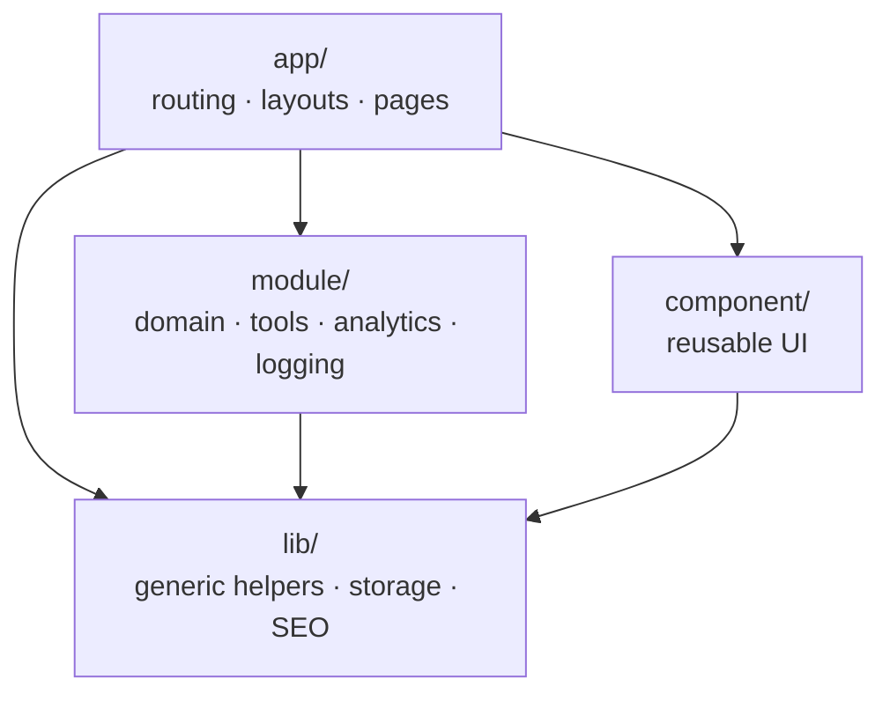
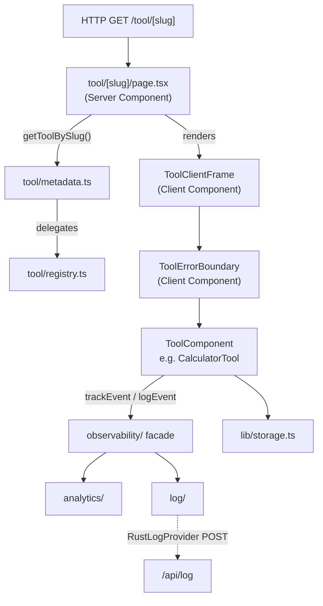

# ARCHITECTURE

## Diagnostic hotfix architecture

Diagnostics preserve bounded redacted Error fields, causes, aggregate children,
React component stacks and explicit runtime context. The observability module
owns the shared serializer/redactor and server diagnostic sink. Browser logs
enter through `/api/log`; Next server failures enter through `onRequestError`.
Both emit structured severity logs independently of optional Neon persistence
in `observability.error_diagnostic`. Deployment context is appended server-side.
Metrics remain separate in the existing event and daily aggregate tables.
Detailed diagnostics expire after 30 days; metric retention remains unchanged.
The private dashboard reads latest-25 diagnostics using its SELECT-only role.
No arbitrary metadata, request headers/bodies, environment dumps or user input
are captured. Additive migrations run explicitly before deployment.

Both Next configurations explicitly bound Turbopack to their own project
directory. This prevents a nested dashboard build from discovering public
instrumentation through an inferred parent lockfile root. Public standalone
file tracing uses the same isolated project root, including contained worktrees.

## Persistent observability and separate dashboard

The public application remains public at the repository root. Its existing
observability facade/providers own browser telemetry. `/api/log` remains the
sanitized technical diagnostic path; `/api/metric` alone persists allowlisted
measurement events, including explicit `client-error` metrics, into Neon Postgres.
Metric tables store no diagnostic text or client timestamps. Dedicated error_diagnostic records preserve bounded redacted diagnostic text and reporter timestamps.
Server receipt time defines UTC aggregation and retention boundaries.

`database/observability` owns the dedicated SQL schema and transactional daily
maintenance. Raw events retain 90 days, with deletion permitted only for a
successfully rolled-up UTC day. Daily event/vital history retains indefinitely.
The operational maintenance route uses CRON_SECRET, not application users or
sessions. Daily cron belongs to the public Vercel project.

`dashboard/` is an independently installable Next.js application deployed as a
second Vercel project. It reads the same database with a SELECT-only production
role. All SQL stays server-side; no dashboard code enters public navigation,
registry, sitemap, service worker or public build. Vercel Authentication with
All Deployments protects only the dashboard project; there is no app auth.

The metric contract adds optional coarse viewport class (width only) and an
explicit error category/tool ID projection. Metric error identity deduplication
is independent of diagnostic-log identity deduplication, preserving both sinks.
See `OBSERVABILITY.md` and `../dashboard/DEPLOYMENT.md`.

### v0.3.1 Vercel Web Analytics boundary

v0.3.1 introduces Vercel Web Analytics as a separate platform-level traffic measurement surface,
not another owner of application-domain telemetry. Automatic page views belong
to the Vercel integration; canonical tool events, Web Vitals, errors and
diagnostics remain owned by the existing application observability contracts.

The implemented code boundary is deliberately small:

- `src/module/analytics/vercelWebAnalytics.client.ts` owns enablement and the
  pure URL/event redaction helper;
- `src/component/observability/VercelWebAnalytics.tsx` owns the framework
  wrapper around `@vercel/analytics/next`;
- `src/app/layout.tsx` composes that wrapper and contains no provider-specific
  event logic.

Equivalent file names may be adjusted during implementation if current
repository retrieval shows an established owner that is more appropriate, but
ownership must remain one-way: tools and domain modules do not import Vercel's
provider package directly.

The first delivery emits no custom Vercel events. A future custom-event
integration must implement/extend the existing analytics-provider abstraction
and canonical safe-event allowlist rather than introduce parallel event names or
duplicate tool telemetry. The integration must also preserve default-off
container/test behavior and must not add Vercel Analytics to the independent
protected dashboard project without separate authorization.

This document defines the architectural boundaries of the project.
Any generated code MUST follow this structure.

## Deployment Runtime Boundary

Production packaging follows `Next.js standalone server → Docker runtime →
public/static assets → browser`. Containerization changes deployment packaging,
not application domain architecture. The generated standalone server serves the
same-origin Worker, decoder, service-worker, manifest, and license assets. See
`docs/DEPLOYMENT.md` for the runtime guide.

## Core Goal

The document family is implemented under `src/module/tool/document/`, with
five explicit registry entries and the existing server tool-route composition.
PdfFile owns source primitives, limits and bounded errors; pageSelection and
orderedFile own pure transitions. Tool components retain operation state,
focus, cancellation, generations, result URLs and identity-only telemetry.

`pdfRuntime.client.ts` imports PDF.js 6.4.299 at operation time for inspection,
rendering and independent output verification. Same-origin assets under
`public/vendor/pdfjs/6.4.299/` contain the native worker and 14 standard fonts;
no CMaps, image WASM or QuickJS assets are shipped. Only `pdfLib.worker.ts`
imports pdf-lib 1.17.1 in production source, for Merge, Split and Images to PDF.
PDF to JPG / PNG uses PDF.js and native canvas encoding/bitmap verification.
Compress PDF composes a distinct short-lived `qpdf.worker.ts` with the pinned
project-owned QPDF 12.4.2 JS/WASM in `public/vendor/qpdf/12.4.2/`, then compares
bytes and independently verifies smaller candidates through PDF.js. It offers
LOSSLESS_STRUCTURAL only; no reduction is a normal outcome.

No document bytes are uploaded or processed by a server. Ordinary assets and
separately enabled safe observability may use the network. Runtimes activate
only for operations and cache on demand through the existing service worker;
they are not shell precache assets. Warmed offline operations have inherited
Batch 6 browser evidence, without promising cold offline availability. Normal
builds consume committed vendor assets; controlled QPDF rebuilds belong to
`script/qpdf/`. The standalone container serves the same assets and notices.
See [PdfFile](modules/PdfFile.md), [PdfProcessing](modules/PdfProcessing.md)
and the five operation specs. There is no universal PDF framework.

Image Resizer, Image Compressor and Image Converter share narrow source-file rules and browser
inspection in `module/tool/image/imageFile.ts` and `imageFile.client.ts` (see
`modules/ImageFile.md`). Their identical source presentation is owned by the
presentation-only `component/tool/image/ImageSourcePanel.tsx`, which receives
display-ready props and imports no module-domain behavior (see
`modules/ImageSourcePanel.md`). All keep operation encoders, React state,
controls/results, object URL ownership and execution telemetry local.
This adds no route, server or generic
processing framework owner.

HEIC Converter introduces a dedicated image worker boundary (see
`modules/HeicConverter.md`). Only `heicConverter.worker.ts` imports
`heic-to/next` from pinned `heic-to@1.5.2`. The wrapper creates a worker lazily
after a selected file passes non-empty/25 MiB prechecks; the decoder is not
part of normal route execution or initial HEIC rendering. Each inspect or
convert operation owns a short-lived worker, terminated on terminal response,
cancellation, replacement, Reset or unmount. Main-thread UI receives only
bounded inspection/result messages and Blobs. HEIC source UI remains local;
the existing shared image owners are not expanded. Production release is
subject to explicit human/legal decoder-license approval.

Build a scalable, full-stack utility platform using Next.js App Router,
with strict separation between:
- routing/composition
- business logic
- UI primitives
- tool implementations

The architecture must remain boring, explicit, and predictable.

---

## High-level Structure

```
src/
  app/          -> routing, layouts, pages (composition only)
  module/       -> domain logic, tools, registries, analytics, logging, observability
  component/    -> reusable UI (no domain logic)
  lib/          -> shared utilities (non-UI)
```

---

## Architecture Diagrams

### Layer dependencies

Arrows show allowed import direction. `lib/` has no project-level imports.



### Tool page rendering pipeline

From HTTP request to rendered tool, showing the server/client split and
observability path.



---

## Responsibilities by layer

### app/
- Defines routes and layouts
- Selects which components/modules to render
- Does NOT implement business logic
- Does NOT contain tool logic
- Server Components by default

**Routes:**
- `/` — Home page (`page.tsx`, `HomeClient.tsx`)
- `/discover` — Tool discovery page with category grouping and search
  (`discover/page.tsx`, `discover/DiscoverClient.tsx`)
- `/tool/[slug]` — Individual tool page (`tool/[slug]/page.tsx`)
- `/category/[category]` — Category listing page (`category/[category]/page.tsx`)
- `/api/health` — Health check endpoint (`api/health/route.ts`)
- `/api/log` — Sanitized technical diagnostics (`api/log/route.ts`)
- `/api/metric` — Bounded measurement ingestion (`api/metric/route.ts`)
- `/api/observability/maintenance` — Cron-protected rollup/retention (`api/observability/maintenance/route.ts`)

**Supporting files:**
- `navData.ts` — Navigation item definitions
- `global.css` — CSS custom properties for theming

### module/
- Owns all domain concepts (tools, registry, capabilities, analytics, logging,
  observability)
- Tool implementations live here
- Analytics abstraction lives here
- Logging module lives here
- Observability facade lives here
- UI allowed ONLY inside tool components
- No routing logic allowed

### component/
- Pure UI components
- No knowledge of tools, slugs, or routing
- No side effects unless explicitly client-only

**Subgroups:**
- `common/` — Generic reusable components (Button, Input, StatusPanel,
  ToolSearch, ThemeToggle)
- `layout/` — App shell, header, footer, navigation and optional ad slots,
  layout types, ServiceWorkerRegister
- `tool/` — Tool-specific presentation components (ToolPageTemplate,
  ToolClientFrame, ToolSection, ToolErrorBoundary)

### lib/
- Generic helpers (SEO helpers, formatting utilities, storage abstraction)
- No React components
- No imports from module/ layer

---

## Server vs Client rule

- Pages (`app/**/page.tsx`) are Server Components
- Tool UI components are Client Components
- Do NOT mark layouts or pages as `"use client"`

---

## Tool system

Tools are the core domain concept. Each tool is a React component registered
in `src/module/tool/registry.ts` via the `tool_definition_list` array.

### Category definitions (`src/module/tool/category.ts`)
- Single runtime owner of canonical category identity: ids, canonical order,
  page title, page description, and validation (`isToolCategory`, definition
  lookup). Static `as const` list; no reflection or dynamic registration.
- `ToolCategory` is derived from this list and re-exported by
  `src/module/tool/type.ts`; there is no second hand-maintained union.
- Canonical order: `document, text, math, everyday, time, image, developer`.
- The registry remains the authority for registered tools and therefore for
  which categories are populated. `getAvailableCategory()` (metadata.ts)
  returns the populated categories in canonical order.
- The category route (`app/category/[category]/page.tsx`) validates and
  describes categories through this module; it keeps no category list or
  title/description switch of its own. Nav, home chips and breadcrumbs keep
  deriving short labels from the id.
- Category color identity is theme tokens in `src/style/theme.css`
  (`[data-category]`); see DESIGN.md.

### Registry (`src/module/tool/registry.ts`)
- Single source of truth for all tool definitions
- Provides low-level queries: `getToolBySlug()`, `getToolByCategory()`
- All tools are explicitly imported and registered

### Metadata index (`src/module/tool/metadata.ts`)
- Higher-level query layer wrapping the registry
- Provides: `getAllTool()`, `getToolSeoBySlug()`, `getAllToolSeo()`,
  `getAvailableCategory()`, `getToolCount()`, `getAllTag()`, `getToolByTag()`,
  `getToolByPopularity()`
- Does NOT duplicate registry data — delegates to `tool_definition_list`
- New query functions go here, not in registry
- `getToolBySlug()` / `getToolByCategory()` remain registry-level exports (see
  above) and are not re-exported from `metadata.ts`

### Current tools

The feature-branch registry contains 15 tools across six populated categories;
the public sitemap derives 23 URLs. v0.3 document tools are implemented and
unreleased; this list is not production deployment evidence.

- **Merge PDF** (`document/MergePdfTool.tsx`) — ordered PDF assembly
- **Split PDF** (`document/SplitPdfTool.tsx`) — ordered page-group outputs
- **Images to PDF** (`document/ImagesToPdfTool.tsx`) — JPEG/PNG page assembly
- **PDF to JPG / PNG** (`document/PdfToImageTool.tsx`) — selected-page export
- **Compress PDF** (`document/CompressPdfTool.tsx`) — lossless structural mode
- **Image Resizer** (`image/ImageResizerTool.tsx`) — local dimension changes
- **Image Compressor** (`image/ImageCompressorTool.tsx`) — truthful byte reduction
- **JPG / PNG / WebP Converter** (`image/ImageConverterTool.tsx`) — local encoding
- **HEIC → JPG / PNG Converter** (`image/HeicConverterTool.tsx`) — isolated decoder
- **Slugify Text** (`text/SlugifyTool.tsx`) — Convert text into URL-safe slugs
- **HTML Text Extractor** (`text/HtmlTextExtractorTool.tsx`) — Extract visible
  text from HTML with preserved line breaks
- **Calculator** (`math/CalculatorTool.tsx`) — Evaluate simple math expressions
- **Length Converter** (`everyday/LengthConverterTool.tsx`) — Convert between
  common length units
- **Weight Converter** (`everyday/WeightConverterTool.tsx`) — Convert between
  common weight units
- **Time Arithmetic** (`time/TimeArithmeticTool.tsx`) — Add and subtract
  HH:MM time values with carry/borrow normalization (`time/timeArithmetic.ts`
  holds the pure `calculateTime`/`addTime`/`subtractTime` logic)

### Recently used tool tracking (`src/module/tool/recentlyUsed.ts`)
- `getRecentTool()` — Returns list of recently used tool slugs
- `recordRecentTool(slug)` — Adds a slug to front of list, deduplicates, caps at
  10
- `clearRecentTool()` — Clears the list
- Uses `storage` abstraction, SSR-safe
- Does not modify tool components — consumer must call `recordRecentTool`
  explicitly

---

## Analytics abstraction (`src/module/analytics/`)

Platform-level analytics with swappable provider.

### Structure
- `type.ts` — event names, event prop interfaces, provider interface
- `provider.ts` — local lightweight provider (console + localStorage counter)
- `index.ts` — public API: `track()`, `identify()`, `enableAnalytic()`,
  `disableAnalytic()`, `setAnalyticProvider()`

### Rules
- Tools call only `trackEvent()` from `@/module/observability`
- No direct SDK usage inside tool components
- Provider can be swapped at startup via `setAnalyticProvider()`
- Events: `tool_opened`, `tool_executed`, `tool_result_copied`,
  `tool_mode_changed`

---

## Logging module (`src/module/log/`)

Internal system visibility with swappable providers.

### Structure
- `types.ts` — `LogLevel` (`debug`, `info`, `warn`, `error`), `LogMeta`
- `provider.ts` — `LogProvider` interface
- `logger.ts` — `ConsoleProvider` (default), `log` object (`log.debug`,
  `log.info`, `log.warn`, `log.error`), `setLogProvider()`, `setLogLevel()`
- `RustLogProvider.ts` — Provider that sends logs to `/api/log` via fetch
  (non-blocking, fail-silent)

### Rules
- Level filtering via `setLogLevel()`
- Providers are swappable via `setLogProvider()`
- All logging is non-blocking and SSR-safe
- `ConsoleProvider` never throws

---

## Observability Layer (`src/module/observability/`)

Combined facade unifying analytics and logging.

### API
- `trackEvent(event, prop)` — Product metrics (delegates to analytics `track()`)
- `logEvent(message, meta?)` — System debugging (delegates to `log.info()`)
- `captureError(error, meta?, trackAsEvent?)` — Logs error and optionally tracks
  an analytics event

### Principles
1. **Separation of Concerns**: Logging (technical) and Analytics (product)
   remain separate layers but are unified in the observability facade.
2. **Layering**:
   - `trackEvent()`: Product metrics.
   - `logEvent()`: System debugging.
   - `captureError()`: Automatic logging + optional analytics emission.
3. **Provider-Swappable**: Both logging and analytics support swappable
   providers.
4. **Non-Blocking**: Observability operations must never throw or block the UI
   thread.

---

## Error Handling Policy

### Tool Error Boundary (`src/component/tool/ToolErrorBoundary.tsx`)
- All tools are wrapped in a global error boundary inside `ToolClientFrame`.
- Catches runtime errors in tool components.
- Calls `captureError()` automatically with toolId and component stack.
- Displays a user-friendly fallback UI with a "Try again" option.

### Rules
- No direct `console.log` usage; use `log.info/warn/error` or `logEvent`.
- No direct analytics SDK calls; use `trackEvent`.
- Always use `captureError` in catch blocks at architectural boundaries.

---

## Log ingestion endpoint (`src/app/api/log/route.ts`)

Server-side endpoint for client log events sent by `RustLogProvider`.

### Behavior
- Accepts bounded POST JSON: `{ level, message, timestamp, meta, pathname }`, with fixed message categories and allowlisted metadata; rejects arbitrary fields and full URLs.
- Validates body shape and log level (`debug`, `info`, `warn`, `error`)
- Writes to server `console.log` as a safe sink
- Returns 204 on success, 400 on invalid input
- Fails safely — never exposes secrets or blocks

---

## Theme module (`src/module/theme/`)

The theme system is a multi-theme registry, not a binary light/dark switch.
`ThemeId` (`themeRegistry.ts`) declares four selectable themes: `system`,
`light`, `dark`, and `onedark`. `docs/DESIGN.md` is the canonical visual authority and documents all four
canonical themes alongside the current theme registry and runtime ownership.

### Structure
- `themeRegistry.ts` — declares `ThemeId`, the `theme_definition_list`
  (id/label/description per theme), `listThemes()`, and the `isThemeId()` type
  guard
- `themeStorage.ts` — `storeTheme(themeId)` / `loadTheme()`, persists the
  chosen `ThemeId` under the `"theme"` storage key via the `storage` adapter
- `themeRuntime.client.ts` — `setTheme(themeId)` / `getThemeFromDom()`, applies
  the theme by setting (or removing, for `"system"`) the `data-theme`
  attribute on `document.documentElement`; browser-context only

### Components
- `ThemeToggle` (`src/component/common/ThemeToggle.tsx`) — Client component in
  Header; lets the user pick from the registered theme list
- `ThemeProvider` (`src/component/common/ThemeProvider.tsx`) — Client
  component that applies the persisted/system theme on mount
- Inline script in `layout.tsx` reads `localStorage("theme")` before paint to
  prevent FOUC
- `suppressHydrationWarning` on `<html>` prevents hydration mismatch

### Behavior
- Reads user preference from `storage` via `themeStorage.loadTheme()`
- Falls back to system preference (`"system"` → no `data-theme` attribute;
  CSS `prefers-color-scheme` rule applies) via `matchMedia`
- Persists choice via `themeStorage.storeTheme(themeId)`
- Sets `data-theme` attribute on `<html>` via `themeRuntime.client.ts` to
  switch CSS variable tokens in `src/style/theme.css`

---

## Navigation wiring

- `NavItem` type in `src/component/layout/type.ts` includes optional `href`
- `navData.ts` defines items with real route hrefs: Home (`/`), Discover
  (`/discover`)
- `VerticalNav` is a Client Component that renders `Link` from `next/link` for
  items with `href`
- Active state determined by `usePathname()` match against `href`
- Items without `href` or with `disabled` render as non-interactive spans

---

## Service worker (`public/sw.js`)

Minimal offline caching for PWA support.

### Strategy
- **Install**: Precaches `/` and `/discover`
- **Navigation requests**: Network first, cache fallback (stale-while-offline)
- **Static assets**: Cache first, network fallback
- **Turbopack worker bootstrap**: Reconstruct cached responses without the
  stored response URL. Different entries share its pathname and use fragment
  parameters, which Cache API keys cannot distinguish. The worker retains its
  constructor URL/fragment while the bootstrap remains available offline.
  Runtime assets cache on demand; no PDF asset is precached.
- **API routes**: Network only (no caching)
- **Activation**: Cleans old caches, claims all clients

### Registration
- `ServiceWorkerRegister` (`src/component/layout/ServiceWorkerRegister.tsx`) —
  Client component
- Registers `/sw.js` on mount, fails silently
- Included in root `layout.tsx`

---

## Persistent state layer (`src/lib/storage.ts`)

Unified persistence abstraction.

### API
- `storage.get<T>(key)` — read and parse JSON
- `storage.set<T>(key, value)` — serialize and write
- `storage.remove(key)` — delete

### Rules
- Backed by localStorage (current implementation)
- SSR-safe: all operations return null / no-op when `window` is undefined
- JSON serialization handled internally
- Designed for future backend swap (cookies, server storage, Rust backend)
- Used by: theme persistence, analytics counter, recently used tools

---

## SEO automation (`src/lib/seo.ts`)

Dynamic metadata generation from tool definitions.

### Functions
- `buildToolMetadata(seo)` — generates Next.js `Metadata` from tool SEO data
- `buildCategoryMetadata(slug, title, description)` — generates metadata for
  category pages

### Rules
- No hardcoded SEO in page files
- Tool pages export `generateMetadata` that calls `buildToolMetadata`
- Category pages export `generateMetadata` that calls `buildCategoryMetadata`
- Scales automatically when new tools are added to registry

---


---

## Test infrastructure

### Framework
- Vitest with Node environment
- Tests follow `*.test.ts` and `*.test.tsx` conventions alongside source files

### Unique test report
- Every test run generates a unique report directory under
  `test-report/<RUN_ID>/`
- RUN_ID is a timestamp + random hex suffix (e.g.,
  `2026-02-14T16-14-23-519Z-980e0fe0`)
- Each report contains `results.json` (JSON) and `results.xml` (JUnit)
- CI uploads `test-report/` as an artifact

### Local validation (`script/verify.ts`)
- Aggregate local validation runner exposed as `npm run verify`
- Runs typecheck, lint, test, and build in order with log capture under a
  shared RUN_ID
- Passes `VITEST_RUN_ID` to vitest so JSON and JUnit reports share the run
  directory
- Contains no governance context, prompt, or coding-agent invocation

### Browser validation foundation
- Document/PDF Batch 1 boundaries and the temporary test-only runtime harness
  are specified in [PdfFile](modules/PdfFile.md) and
  [PdfProcessing](modules/PdfProcessing.md). All five public document tools are
  registered; operation-specific unit/component and real-file browser tests
  complement the foundation harness and document-family integration tests.
- Playwright is a separate production-browser validation subsystem in
  `playwright.config.ts` and `test/e2e/`; it is not part of `script/verify.ts`.
- `npm run build` precedes `npm run test:e2e`. Playwright owns a fresh production
  server at `http://127.0.0.1:3100` and never reuses an existing server.
- Desktop and mobile Chromium contexts protect existing routes, shell,
  document scrolling, theme persistence, diagnostics and service worker.
- Unique browser evidence belongs in `test-report/e2e/<RUN_ID>/`.
- Current image-family contracts are specified in
  [ImageFileProcessing](modules/ImageFileProcessing.md). ImageFile shares only
  source primitives; ImageSourcePanel shares presentation. Encoding, state,
  generation tokens, results and URL lifecycles remain operation-local.
- Real HEIC JPEG/PNG conversion and fresh-context application isolation are
  validated against the registered production tool. Only the dedicated worker
  imports `heic-to/next`; no decoder loads before size-checked file interaction
  or on unrelated routes. Workers terminate per operation and on invalidation.
- Expected image errors stay local and actionable; unexpected React rendering
  errors remain ToolErrorBoundary-owned. License approval remains a release gate.

### CI pipeline
Five separate GitHub Actions workflows: `typecheck.yaml`, `lint.yaml`,
`test.yaml`, `build.yaml`, `e2e.yaml`. All must pass when exercised. E2E workflow
execution for the intermediate v0.2 branch is pending the final version PR.

---

## Forbidden patterns

- Tool logic inside `app/`
- Implicit magic or reflection-based wiring
- Dynamic imports without explicit intent
- Tight coupling between components and tools
- Business logic in UI components
- Direct analytics SDK usage in tools
- lib/ importing from module/

If unsure, STOP and ask for clarification.
# Deployment runtime boundary

Production packaging adds this deployment path without changing application
domain architecture:

```text
Next.js standalone server → Docker runtime → public/static assets → browser
```

The runtime uses the Next-generated standalone server and serves Worker,
decoder, service-worker, manifest, and public license assets from the same
application origin. Docker is an optional packaging/runtime layer; it does not
move tool logic out of the existing application layers. See
`docs/DEPLOYMENT.md` for operation details.

## Production integration ownership

Existing observability facade and analytics/logger interfaces remain authoritative. Explicit browser opt-in selects same-origin network providers; defaults stay local. Metric validation/transport and server-only Neon persistence belong to module/observability; API routes adapt transport. Structured hosting logs remain active. `/api/log` keeps technical diagnostics separate from durable `/api/metric` measurements. Early instrumentation selects providers before tool effects. An isolated Web Vitals client uses the Next hook. Public advertising configuration belongs to module/ad; one reusable slot and one Next Script compose through AppShell. The v0.3.1 Vercel Web Analytics SDK is an additive exception, isolated to `src/component/observability/VercelWebAnalytics.tsx` and composed once from `src/app/layout.tsx`; its exact-true policy and URL sanitizer belong to `src/module/analytics/vercelWebAnalytics.client.ts`. It sends automatic page views only and remains default-off pending external production activation. Existing analytics, observability, Web Vitals and instrumentation-client ownership are preserved. The independent dashboard and SQL maintenance boundaries are defined at the start of this document.

## UI/discovery Delivery 2 ownership

The approved image workspace composition extends each local image tool without moving operation state or encoders. `src/module/tool/guide.ts` is a small typed server-consumed prose/related-ID companion, not a catalog. Tool identity remains in registry.ts; metadata.ts resolves ID lists and breadcrumb presentation. Tool route composes these server values into ToolPageTemplate; guide data must never be imported into the client catalog. `src/lib/seo.ts` remains generic and owns one canonical origin plus the conservative environment indexability decision. App Router sitemap/robots files compose the established helpers and registry-derived queries. No new search owner or generic image framework.
